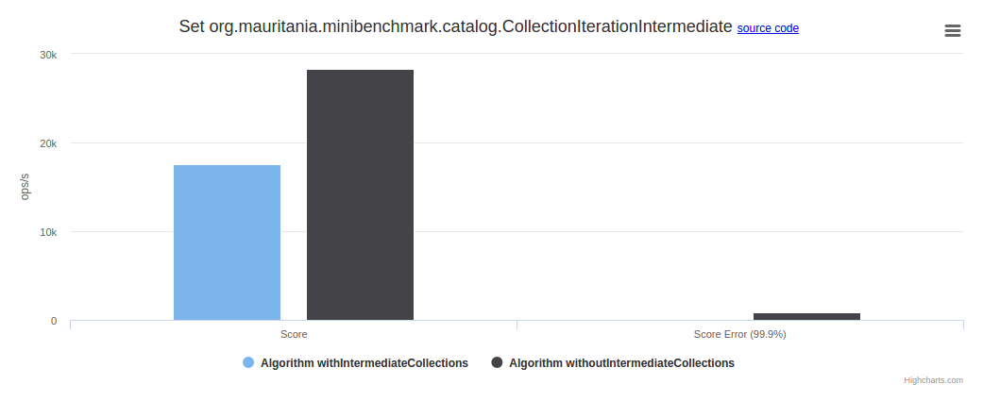

# README

[](https://mauriciojost.github.io/scala-benchmark/)

[](src/main/scala/org/mauritania/minibenchmark/catalog/)

This project aims to help into providing empirical arguments about performance of similar algorithms implemented in Scala. 
It uses [JMH](http://openjdk.java.net/projects/code-tools/jmh/) under the hood for benchmarking.

Comparable algorithms (that do the same in different ways) are called sets of algorithms.

A set of comparable argorithms is implemented in a regular class with a simple anotation on benchmarked methods. 
For example:

```scala
package org.mauritania.minibenchmark.catalog

import org.mauritania.mauritania._
import org.openjdk.jmh.annotations.Benchmark

class CollectionIterationIntermediate {

  @Benchmark
  def withIntermediateCollections(): Int = {
    LargeList.
      map(i => i + 1).
      map(i => i * 2).
      sum
  }

  @Benchmark
  def withoutIntermediateCollections(): Int = {
    LargeList.
      view.
      map(i => i + 1).
      map(i => i * 2).
      force.
      sum
  }

}
```

This would generate the following report:



 **New algorithm sets can be very easily added!**

## QUICK EXECUTION

To execute the benchmarks and simply display the results, using _sbt_ just do:

```bash
sbt clean "jmh:run -help"
sbt clean "jmh:run -i 3 -wi 3 -f1 -t1 .*Identity.*"
```

## GENERATE THE REPORT

You can generate the visualisation report with the benchmarking result of the algorithms available in the catalog, so that it can be shared later. 
For that you can do as follows:

```bash
cd report
bash generate-reports.bash
```
A new [raw.csv](report/input/raw.csv) file will be generated. Then you can locally browse [index.html](index.html).

### REPORT ON GITHUB

If you want to generate a report that you can share with other people, 
- fork the project in GitHub
- enable GitHub pages for your fork (on _master_ branch)
- generate the report and commit the changed _raw.csv_
- browse the GitHub page

## NOTES

I recommend to use the following commands to go further in the investigation:

```bash
scala -Xshow-phases
sbt 'set scalacOptions ++=Seq("-Xprint:namer")' compile
sbt 'set scalacOptions ++=Seq("-Xprint:mixin")' compile
```


